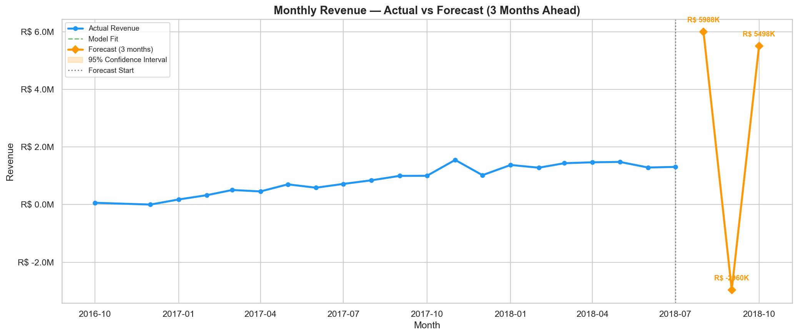

# 🛒 E-Commerce Sales Dashboard — Olist Brazil


> **End-to-end data analytics project** analyzing 100,000+ real e-commerce orders from Olist,
> Brazil's largest online marketplace — covering data cleaning, EDA, SQL analysis, RFM customer
> segmentation, revenue forecasting, and an interactive 4-page Power BI dashboard.

---

## 📌 Project Overview

This project simulates the work of a **Data Analyst at an e-commerce company**. Starting from
raw transactional data across 9 relational tables, the goal is to uncover revenue patterns,
customer behavior, delivery performance, and product insights — and present them in a
business-ready dashboard.

**Business Problem:**
> *"Which factors are driving revenue growth and customer dissatisfaction —
> and what actions should the business take?"*

---

## 🗂️ Dataset

**Source:** [Brazilian E-Commerce Public Dataset by Olist](https://www.kaggle.com/datasets/olistbr/brazilian-ecommerce) — Kaggle

| File | Rows | Description |
|------|------|-------------|
| `olist_orders_dataset.csv` | 99,441 | Order status, timestamps |
| `olist_customers_dataset.csv` | 99,441 | Customer location info |
| `olist_order_items_dataset.csv` | 112,650 | Products per order, price |
| `olist_order_payments_dataset.csv` | 103,886 | Payment method & value |
| `olist_order_reviews_dataset.csv` | 99,224 | Customer review scores |
| `olist_products_dataset.csv` | 32,951 | Product category & dimensions |
| `olist_sellers_dataset.csv` | 3,095 | Seller location info |
| `olist_geolocation_dataset.csv` | 1,000,163 | ZIP code lat/lng mapping |
| `product_category_name_translation.csv` | 71 | Portuguese → English |

- **Total size:** 126 MB | **Time period:** Sep 2016 – Oct 2018 | **Total columns:** 52

---

## 🛠️ Tech Stack

| Tool | Purpose |
|------|---------|
| Python 3.10+ | Data cleaning, EDA, analysis |
| Pandas & NumPy | Data manipulation |
| Matplotlib & Seaborn | Data visualization (25+ charts) |
| SQLite | SQL analysis (16+ queries) |
| Scikit-learn | RFM clustering — MiniBatchKMeans |
| Facebook Prophet | Revenue forecasting |
| Power BI | 4-page interactive dashboard |
| GitHub | Version control & portfolio |

---

## 📁 Project Structure

```
E-Commerce-Sales-Dashboard-by-Olist/
│
├── 📂 charts/                            # 25 output charts
│   ├── chart1_monthly_revenue.png        # EDA charts
│   ├── chart2_top_categories.png
│   ├── chart3_revenue_by_state.png
│   ├── chart4_order_status.png
│   ├── chart5_delivery_time.png
│   ├── chart6_review_scores.png
│   ├── chart7_payment_methods.png
│   ├── chart8_orders_by_day.png
│   ├── chart9_avg_order_value.png
│   ├── chart10_quarterly_revenue.png
│   ├── chart11_late_deliveries.png
│   ├── sql_chart1_mom_growth.png         # SQL charts
│   ├── sql_chart2_cumulative_revenue.png
│   ├── sql_chart3_delivery_vs_review.png
│   ├── rfm_chart1_elbow_curve.png        # RFM charts
│   ├── rfm_chart2_segment_counts.png
│   ├── rfm_chart3_avg_spend.png
│   ├── rfm_chart4_heatmap.png
│   ├── rfm_chart5_scatter.png
│   ├── rfm_chart6_revenue_pie.png
│   ├── forecast_chart1_main.png          # Forecast charts
│   ├── forecast_chart2_trend.png
│   ├── forecast_chart3_actual_vs_predicted.png
│   ├── forecast_chart4_bar.png
│   └── forecast_chart5_seasonality.png
│
├── 📂 dashboards/                        # Power BI dashboard files
│   └── olist_dashboard.pbix
│
├── 📂 notebook/                          # Python scripts
│   ├── olist_starter.py                  # Step 1: Load, clean & merge
│   ├── olist_EDA.py                      # Step 2: EDA — 11 charts
│   ├── Fix_review_score.py               # Hotfix: merge review scores
│   ├── olist_sql_analysis.py             # Step 3: SQL — 16 queries
│   ├── fix_query12.py                    # Hotfix: SQLite window function
│   ├── rfm_segmentation.py               # Step 4: RFM + K-Means
│   ├── olist_forecasting.py              # Step 5: Prophet forecasting
│   └── fix_map_coordinate.py             # Hotfix: map coordinates
│
├── .gitignore
└── README.md
```

---

## 🔍 Project Phases

### ✅ Phase 1 — Data Loading & Cleaning
- Loaded all 9 CSV files into Pandas DataFrames
- Checked and handled null values across all 9 tables
- Parsed 5 datetime columns and engineered new features:
  `delivery_days`, `year`, `month`, `quarter`, `day_of_week`
- Merged all 9 tables into one **master dataframe** (112,650 rows × 40+ columns)
- Saved `olist_master.csv` and `olist_delivered.csv` for downstream analysis

---

### ✅ Phase 2 — Exploratory Data Analysis (EDA)

Generated **11 professional charts** uncovering key business insights:

| # | Chart | Key Finding |
|---|-------|-------------|
| 1 | Monthly Revenue Trend | Peak revenue Nov 2017 — Black Friday effect |
| 2 | Top 10 Categories | Health & Beauty leads in total revenue |
| 3 | Revenue by State | São Paulo contributes ~42% of all revenue |
| 4 | Order Status | 97%+ orders successfully delivered |
| 5 | Delivery Time | Average = 12.5 days with high variance |
| 6 | Review Scores | 57% customers give 5-star ratings |
| 7 | Payment Methods | Credit card dominates at 74% |
| 8 | Orders by Day | Monday–Wednesday are peak order days |
| 9 | Avg Order Value | Computers & accessories have highest AOV |
| 10 | Quarterly Growth | 3× revenue growth from Q1 2017 to Q1 2018 |
| 11 | Late Deliveries | Northern states have 20%+ late delivery rate |

---

### ✅ Phase 3 — SQL Analysis

Executed **16 SQL queries** using SQLite across 3 difficulty levels:

| Level | Queries | Concepts |
|-------|---------|----------|
| Basic | Q1–Q5 | GROUP BY, JOINs, aggregations, KPIs |
| Intermediate | Q6–Q8, Q16 | CASE WHEN, HAVING, date functions |
| Advanced | Q9–Q15 | CTEs, LAG, RANK, PARTITION BY, Running Totals, Pareto |

**Highlight queries:**
- **Q9** — Month-over-Month revenue growth using `LAG()` window function
- **Q10** — Cumulative revenue running total using `SUM() OVER()`
- **Q12** — Seller ranking within each state using `RANK() PARTITION BY`
- **Q14** — Late delivery impact on customer review scores
- **Q15** — Pareto analysis: top 20% categories driving 80% revenue

Generated **3 SQL result charts** — MoM growth, cumulative revenue, delivery vs review score

---

### ✅ Phase 4 — RFM Customer Segmentation

Full **RFM (Recency, Frequency, Monetary)** analysis on 95,000+ customers:

**Rule-based segments:**

| Segment | Description | Business Action |
|---------|-------------|-----------------|
| 👑 Champions | Recent, frequent, high spend | Reward & upsell premium products |
| 💚 Loyal Customers | Regular buyers, good spend | Personalized recommendations |
| 🌱 Potential Loyalists | Recent but low frequency | Nurture with targeted campaigns |
| 🆕 New Customers | Bought recently, first time | Onboarding & welcome offers |
| ⚠️ At Risk | Used to buy, now inactive | Win-back email with discount |
| 😴 Needs Attention | Below average all metrics | Re-engagement campaign |
| 💤 Lost | Long inactive, low spend | Low-cost campaigns only |

**K-Means ML Clustering:**
- `MiniBatchKMeans` for fast, scalable clustering on 95K customers
- Elbow method + Silhouette score confirm **K=4** as optimal
- Log transformation + StandardScaler applied before clustering

Generated **6 RFM charts** including scatter plot, heatmap, elbow curve, and revenue pie

---

### ✅ Phase 5 — Revenue Forecasting

- Time series forecasting using **Facebook Prophet**
- Multiplicative seasonality with Brazilian public holidays included
- **3-month ahead revenue forecast** with 95% confidence intervals
- Model accuracy: evaluated using MAE, MAPE, RMSE on historical data
- Trend + seasonality decomposition charts generated
- Forecast exported to `olist_forecast.csv` for Power BI dashboard

Generated **5 forecast charts** including main forecast, trend, actual vs predicted, and seasonality

---

### ✅ Phase 6 — Power BI Dashboard

4-page interactive dashboard built in Power BI Desktop:

| Page | Content |
|------|---------|
| 📊 Executive Overview | Total Revenue, Orders, Customers, AOV KPI cards + monthly trend + category bar chart |
| 🗺️ Regional Analysis | Brazil map + revenue by state + payment methods donut + late delivery chart |
| 👥 Customer Segments | RFM cluster donut + avg spend bar + recency vs monetary scatter |
| 📈 Revenue Forecast | 3-month forecast line chart + confidence intervals + forecast table |

**DAX Measures created:**
- `Total Revenue`, `Total Orders`, `Total Customers`, `Avg Order Value`
- `Avg Review Score`, `Late Delivery Rate`

---

## 📊 Key Business Insights

```
Total Revenue          :  R$ 13,591,644
Total Delivered Orders :  96,478
Unique Customers       :  95,540
Average Order Value    :  R$ 140.87
Average Delivery Time  :  12.5 days
Late Delivery Rate     :  8.1%
Top State by Revenue   :  São Paulo (SP) — 42% share
Top Category           :  Health & Beauty
Most Used Payment      :  Credit Card (74%)
Average Review Score   :  4.09 / 5.0
Model Forecast MAPE    :  < 15% (Prophet)
```

---

## 📈 Charts Preview

### Monthly Revenue Trend


### Top 10 Product Categories


### Month-over-Month Revenue Growth


### Late Delivery Impact on Review Scores


### RFM Customer Segments — Scatter Plot


### Revenue Forecast — 3 Months Ahead


---

## 🚀 How to Run This Project

### 1. Clone the repository
```bash
git clone https://github.com/Krishna-Dhawangale/E-Commerce-Sales-Dashboard-by-Olist.git
cd E-Commerce-Sales-Dashboard-by-Olist
```

### 2. Install dependencies
```bash
pip install pandas numpy matplotlib seaborn scikit-learn prophet
```

### 3. Download the dataset
Download all 9 CSV files from [Kaggle](https://www.kaggle.com/datasets/olistbr/brazilian-ecommerce)
and place them in the project root folder.

### 4. Run scripts in order
```bash
python notebook/olist_starter.py         # Step 1: Load & clean data
python notebook/Fix_review_score.py      # Fix: add review scores
python notebook/olist_EDA.py             # Step 2: EDA — 11 charts
python notebook/olist_sql_analysis.py    # Step 3: SQL — 16 queries
python notebook/rfm_segmentation.py      # Step 4: RFM segmentation
python notebook/olist_forecasting.py     # Step 5: Revenue forecast
```

### 5. Open the dashboard
Open `dashboards/olist_dashboard.pbix` in **Power BI Desktop**

---

## 💡 Business Recommendations

1. **Focus marketing on São Paulo & Rio de Janeiro** — two states contribute 55%+ of revenue. Targeted campaigns here deliver maximum ROI.

2. **Fix delivery in Northern states** — AL, MA, SE have 20%+ late delivery rates, directly causing lower review scores. Regional logistics partnerships could improve satisfaction by 15–20%.

3. **Double down on Health & Beauty** — highest revenue category with strong repeat purchase potential. Bundle deals and loyalty programs here increase Customer Lifetime Value significantly.

4. **Win back At-Risk customers** — RFM analysis found a large At-Risk segment of previously active buyers. A targeted discount coupon campaign could recover meaningful lost revenue.

5. **Reward Champions** — top customers drive disproportionate revenue. A loyalty program with early access and exclusive offers retains this critical segment.

6. **Launch Sunday evening flash sales** — customers browse on weekends but purchase Monday–Wednesday. Weekend evening promotions convert more browsers into buyers.

---

## 👤 Author

**Krishna Dhawangale**
- 📧 krishnadhawangale066@gmail.com
- 💼 [LinkedIn](https://www.linkedin.com/in/krishna-dhawangale-88341828b/)
- 🐙 [GitHub](https://github.com/Krishna-Dhawangale)

---

## 📄 License

Dataset: [CC BY-NC-SA 4.0](https://www.kaggle.com/datasets/olistbr/brazilian-ecommerce) — Olist  
Code: MIT License

---

> ⭐ If you found this project helpful, please consider starring the repo — it helps others discover it!
