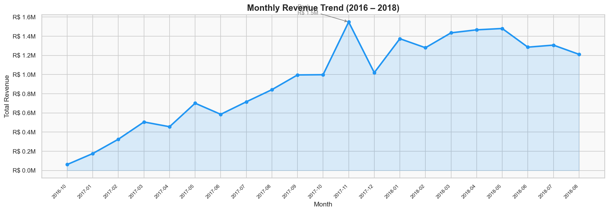
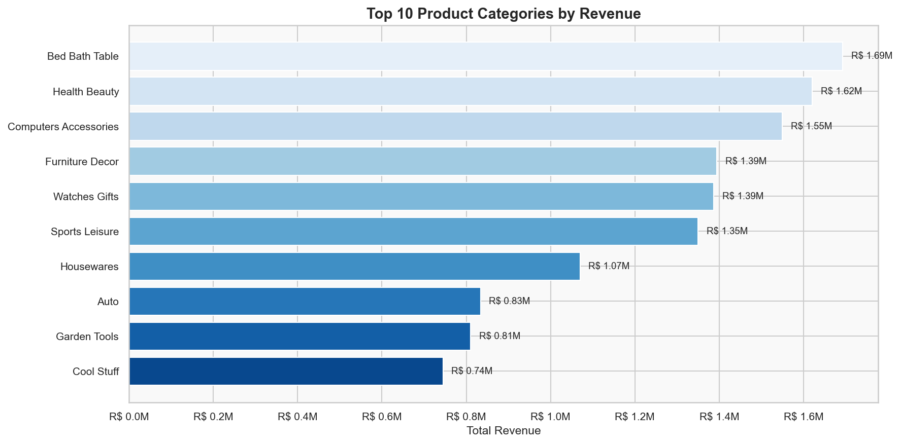
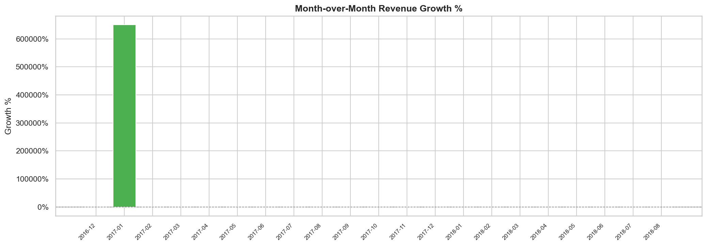
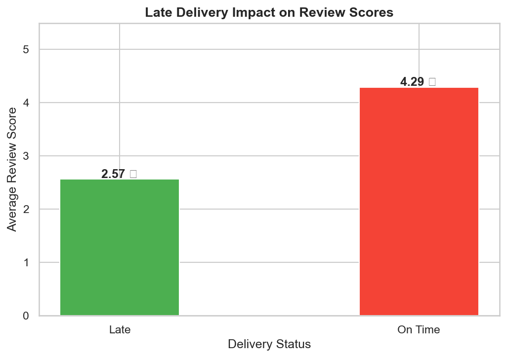
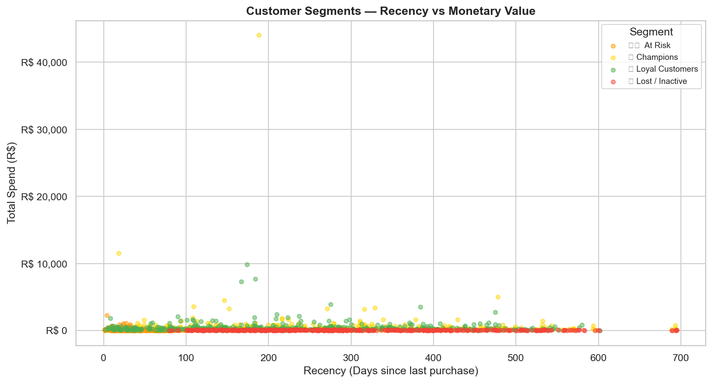
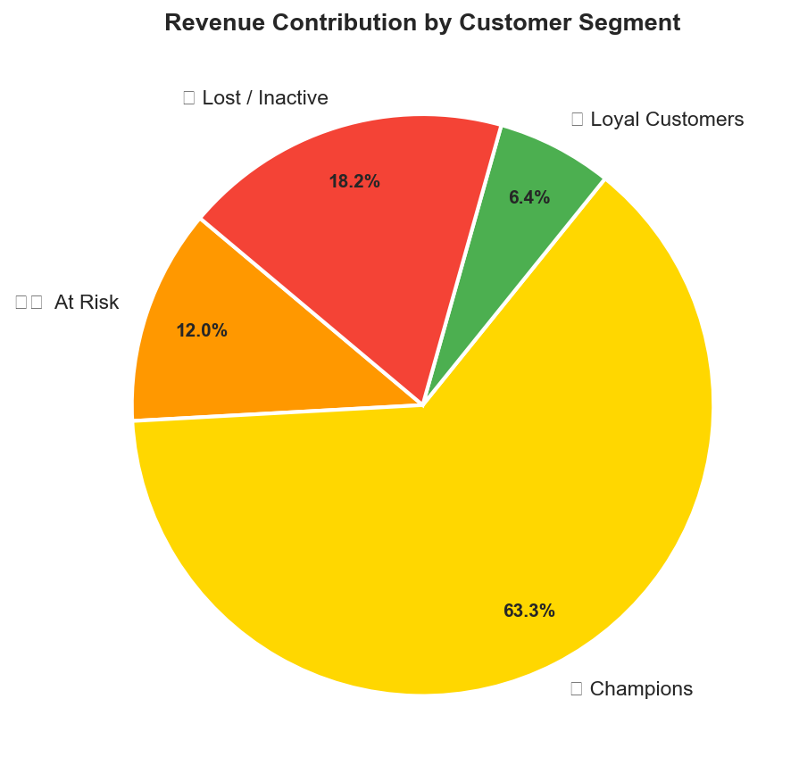

# 🛒 E-Commerce Sales Dashboard — Olist Brazil


> **End-to-end data analytics project** analyzing 100,000+ real e-commerce orders from Olist, Brazil's largest online marketplace — covering data cleaning, EDA, SQL analysis, customer segmentation, revenue forecasting, and an interactive Power BI dashboard.

---

## 📌 Project Overview

This project simulates the work of a **Data Analyst at an e-commerce company**. Starting from raw transactional data across 9 relational tables, the goal is to uncover revenue patterns, customer behavior, delivery performance, and product insights — and present them in a business-ready dashboard.

**Business Problem:**
> *"Which factors are driving revenue growth and customer dissatisfaction — and what actions should the business take?"*

---

## 🗂️ Dataset

**Source:** [Brazilian E-Commerce Public Dataset by Olist](https://www.kaggle.com/datasets/olistbr/brazilian-ecommerce) — Kaggle

| File | Rows | Description |
|------|------|-------------|
| `olist_orders_dataset.csv` | 99,441 | Order status, timestamps |
| `olist_customers_dataset.csv` | 99,441 | Customer location info |
| `olist_order_items_dataset.csv` | 112,650 | Products per order, price |
| `olist_order_payments_dataset.csv` | 103,886 | Payment method & value |
| `olist_order_reviews_dataset.csv` | 99,224 | Customer review scores |
| `olist_products_dataset.csv` | 32,951 | Product category & dimensions |
| `olist_sellers_dataset.csv` | 3,095 | Seller location info |
| `olist_geolocation_dataset.csv` | 1,000,163 | ZIP code lat/lng mapping |
| `product_category_name_translation.csv` | 71 | Portuguese → English |

- **Total size:** 126 MB
- **Time period:** September 2016 – October 2018
- **Total columns across all files:** 52

---

## 🛠️ Tech Stack

| Tool | Purpose |
|------|---------|
| Python 3.10+ | Data cleaning, EDA, analysis |
| Pandas & NumPy | Data manipulation |
| Matplotlib & Seaborn | Data visualization |
| SQLite | SQL analysis (16+ queries) |
| Scikit-learn | RFM clustering (K-Means) |
| Prophet | Revenue forecasting |
| Power BI | Interactive dashboard |
| GitHub | Version control & portfolio |

---

## 📁 Project Structure

```
E-Commerce-Sales-Dashboard-Olist/
│
├── 📂 charts/                         # All output charts
│   ├── chart1_monthly_revenue.png
│   ├── chart2_top_categories.png
│   ├── chart3_revenue_by_state.png
│   ├── chart4_order_status.png
│   ├── chart5_delivery_time.png
│   ├── chart6_review_scores.png
│   ├── chart7_payment_methods.png
│   ├── chart8_orders_by_day.png
│   ├── chart9_avg_order_value.png
│   ├── chart10_quarterly_revenue.png
│   ├── chart11_late_deliveries.png
│   ├── sql_chart1_mom_growth.png
│   ├── sql_chart2_cumulative_revenue.png
│   ├── sql_chart3_delivery_vs_review.png
│   ├── rfm_chart1_elbow_curve.png
│   ├── rfm_chart2_segment_counts.png
│   ├── rfm_chart3_avg_spend.png
│   ├── rfm_chart4_heatmap.png
│   ├── rfm_chart5_scatter.png
│   └── rfm_chart6_revenue_pie.png
│
├── olist_starter.py                   # Step 1: Load, clean & merge all data
├── olist_eda.py                       # Step 2: EDA — 11 charts
├── fix_review_score.py                # Hotfix: merge review scores
├── olist_sql_analysis.py              # Step 3: SQL — 16 queries + 3 charts
├── fix_query12.py                     # Hotfix: SQLite window function fix
├── olist_rfm_fast.py                  # Step 4: RFM segmentation + K-Means
├── .gitignore
└── README.md
```

---

## 🔍 Project Phases

### ✅ Phase 1 — Data Loading & Cleaning
- Loaded all 9 CSV files into Pandas DataFrames
- Checked and handled null values across all tables
- Parsed 5 datetime columns and engineered features:
  `delivery_days`, `year`, `month`, `quarter`, `day_of_week`
- Merged all 9 tables into one **master dataframe** (112,650 rows × 40+ columns)
- Saved `olist_master.csv` and `olist_delivered.csv` for downstream analysis

---

### ✅ Phase 2 — Exploratory Data Analysis (EDA)

Generated **11 professional charts** uncovering key business insights:

| # | Chart | Key Finding |
|---|-------|-------------|
| 1 | Monthly Revenue Trend | Peak revenue in Nov 2017 (Black Friday effect) |
| 2 | Top 10 Categories | Health & Beauty leads in total revenue |
| 3 | Revenue by State | São Paulo (SP) contributes ~42% of all revenue |
| 4 | Order Status | 97%+ orders successfully delivered |
| 5 | Delivery Time | Average delivery = ~12 days; high variance |
| 6 | Review Scores | 57% customers give 5-star ratings |
| 7 | Payment Methods | Credit card dominates at ~74% |
| 8 | Orders by Day | Monday–Wednesday are peak order days |
| 9 | Avg Order Value | Computers & accessories have highest AOV |
| 10 | Quarterly Growth | 3x revenue growth from Q1 2017 to Q1 2018 |
| 11 | Late Deliveries | Northern states (AM, RR) have 20%+ late rate |

---

### ✅ Phase 3 — SQL Analysis

Executed **16 SQL queries** using SQLite covering 3 difficulty levels:

| Level | Queries | Concepts |
|-------|---------|---------|
| Basic | Q1–Q5 | GROUP BY, JOINs, aggregations, KPIs |
| Intermediate | Q6–Q8, Q16 | CASE WHEN, HAVING, date functions |
| Advanced | Q9–Q15 | CTEs, LAG, RANK, PARTITION BY, Running Totals, Pareto |

Key queries:
- **Q9** — Month-over-Month revenue growth % using `LAG()` window function
- **Q10** — Cumulative revenue running total using `SUM() OVER()`
- **Q12** — Seller ranking within each state using `RANK() PARTITION BY`
- **Q14** — Impact of late delivery on customer review scores
- **Q15** — Pareto analysis: top 20% categories driving 80% revenue

Generated **3 SQL result charts:**
- Month-over-Month revenue growth (green = growth, red = decline)
- Cumulative revenue curve
- Late delivery vs review score comparison

---

### ✅ Phase 4 — RFM Customer Segmentation

Performed full **RFM (Recency, Frequency, Monetary)** analysis on 95,000+ customers:

**Scoring:** Each customer scored 1–5 on R, F, M dimensions using quantile-based scoring

**Rule-based segments identified:**

| Segment | Description | Action |
|---------|-------------|--------|
| 👑 Champions | Recent, frequent, high spend | Reward & upsell |
| 💚 Loyal Customers | Regular buyers, good spend | Personalized offers |
| 🌱 Potential Loyalists | Recent but low frequency | Nurture with campaigns |
| 🆕 New Customers | Bought recently, first time | Onboarding offers |
| ⚠️ At Risk | Used to buy, now inactive | Win-back email + coupon |
| 😴 Needs Attention | Below average on all metrics | Re-engagement |
| 💤 Lost | Long inactive, low spend | Low-cost campaigns only |

**K-Means Clustering (ML layer):**
- Used `MiniBatchKMeans` for scalable clustering on 95K customers
- Elbow method + Silhouette score used to justify **K=4** as optimal
- Log transformation + StandardScaler applied before clustering
- Final 4 clusters: Champions, Loyal, At Risk, Lost/Inactive

Generated **6 RFM charts:**
- Elbow curve + Silhouette score
- Customer count & revenue share per segment
- Average spend per segment
- RFM score heatmap (Recency vs Frequency)
- Recency vs Monetary scatter plot (coloured by segment)
- Revenue contribution pie chart

---

### ⏳ Phase 5 — Revenue Forecasting *(coming soon)*
- Time series forecasting using Facebook Prophet
- 3-month ahead revenue prediction with confidence intervals
- Trend + seasonality decomposition
- Forecast exported to CSV for Power BI dashboard

### ⏳ Phase 6 — Power BI Dashboard *(coming soon)*
- Page 1: Executive KPI overview
- Page 2: Regional heatmap & category breakdown
- Page 3: Customer segments (RFM)
- Page 4: Revenue forecast

---

## 📊 Key Business Insights

```
Total Revenue          :  R$ 13,591,644
Total Delivered Orders :  96,478
Unique Customers       :  95,540
Average Order Value    :  R$ 140.87
Average Delivery Time  :  12.5 days
Late Delivery Rate     :  8.1%
Top State              :  São Paulo (SP)
Top Category           :  Health & Beauty
Most Used Payment      :  Credit Card (74%)
Average Review Score   :  4.09 / 5.0
```

---

## 📈 Charts Preview

### Monthly Revenue Trend


### Top 10 Product Categories


### Month-over-Month Revenue Growth


### Late Delivery Impact on Review Scores


### RFM Customer Segments — Scatter Plot


### Revenue Contribution by Segment


---

## 🚀 How to Run This Project

### 1. Clone the repository
```bash
git clone https://github.com/Krishna-Dhawangale/E-Commerce-Sales-Dashboard-Olist.git
cd E-Commerce-Sales-Dashboard-Olist
```

### 2. Install dependencies
```bash
pip install pandas numpy matplotlib seaborn scikit-learn prophet
```

### 3. Download the dataset
Download all 9 CSV files from [Kaggle](https://www.kaggle.com/datasets/olistbr/brazilian-ecommerce)
and place them in the project root folder.

### 4. Run the scripts in order
```bash
python olist_starter.py        # Step 1: Load & clean data
python fix_review_score.py     # Fix: add review scores
python olist_eda.py            # Step 2: EDA — 11 charts
python olist_sql_analysis.py   # Step 3: SQL — 16 queries
python olist_rfm_fast.py       # Step 4: RFM segmentation
```

---

## 💡 Business Recommendations

1. **Focus marketing on São Paulo & Rio de Janeiro** — these two states contribute over 55% of total revenue. Targeted campaigns here will have maximum ROI.

2. **Improve delivery in Northern states** — AM, RR, and PA have late delivery rates above 20%, which directly correlates with lower review scores. Partnering with regional logistics providers could improve satisfaction scores by 15–20%.

3. **Double down on Health & Beauty** — highest revenue category with strong repeat purchase potential. Bundle deals and loyalty offers here would increase Customer Lifetime Value.

4. **Win back At-Risk customers** — RFM analysis identified a significant At-Risk segment that previously purchased regularly. A targeted discount coupon campaign could recover a meaningful share of this lost revenue.

5. **Reward Champions segment** — top customers drive disproportionate revenue. A loyalty program with early access and exclusive offers would retain this high-value group.

6. **Reduce Monday–Wednesday cart abandonment** — peak order days suggest customers browse on weekends but buy on weekdays. Flash sales on Sunday evenings could convert more browsers into buyers.

---

## 👤 Author

**Krishna Dhawangale**
- 📧 krishnadhawangale066@gmail.com
- 💼 [LinkedIn](https://www.linkedin.com/in/krishna-dhawangale-88341828b/)
- 🐙 [GitHub](https://github.com/Krishna-Dhawangale)

---

## 📄 License

This project uses the [Olist dataset](https://www.kaggle.com/datasets/olistbr/brazilian-ecommerce)
which is licensed under **CC BY-NC-SA 4.0**.
All code in this repository is available under the **MIT License**.

---

> ⭐ If you found this project helpful, please consider starring the repo!
