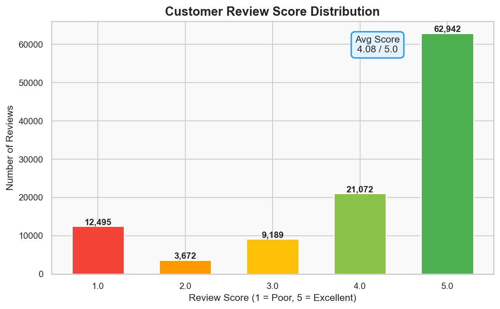
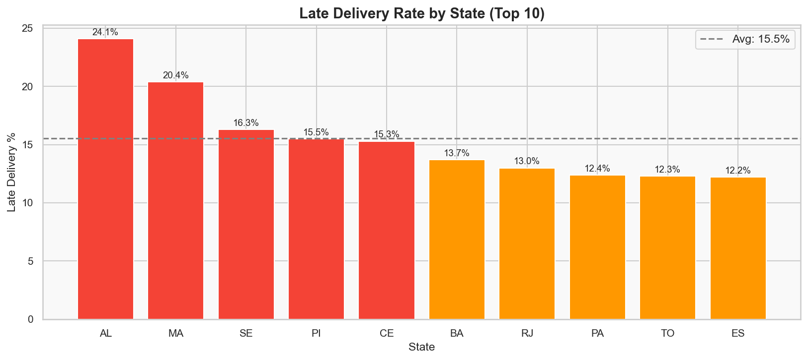

# 🛒 E-Commerce Sales Dashboard — Olist Brazil


> **End-to-end data analytics project** analyzing 100,000+ real e-commerce orders from Olist, Brazil's largest online marketplace — covering data cleaning, EDA, SQL analysis, customer segmentation, revenue forecasting, and an interactive Power BI dashboard.

---

## 📌 Project Overview

This project simulates the work of a **Data Analyst at an e-commerce company**. Starting from raw transactional data across 9 relational tables, the goal is to uncover revenue patterns, customer behavior, delivery performance, and product insights — and present them in a business-ready dashboard.

**Business Problem:**
> *"Which factors are driving revenue growth and customer dissatisfaction — and what actions should the business take?"*

---

## 🗂️ Dataset

**Source:** [Brazilian E-Commerce Public Dataset by Olist](https://www.kaggle.com/datasets/olistbr/brazilian-ecommerce) — Kaggle

| File | Rows | Description |
|------|------|-------------|
| `olist_orders_dataset.csv` | 99,441 | Order status, timestamps |
| `olist_customers_dataset.csv` | 99,441 | Customer location info |
| `olist_order_items_dataset.csv` | 112,650 | Products per order, price |
| `olist_order_payments_dataset.csv` | 103,886 | Payment method & value |
| `olist_order_reviews_dataset.csv` | 99,224 | Customer review scores |
| `olist_products_dataset.csv` | 32,951 | Product category & dimensions |
| `olist_sellers_dataset.csv` | 3,095 | Seller location info |
| `olist_geolocation_dataset.csv` | 1,000,163 | ZIP code lat/lng mapping |
| `product_category_name_translation.csv` | 71 | Portuguese → English |

- **Total size:** 126 MB
- **Time period:** September 2016 – October 2018
- **Total columns across all files:** 52

---

## 🛠️ Tech Stack

| Tool | Purpose |
|------|---------|
| Python 3.10+ | Data cleaning, EDA, analysis |
| Pandas & NumPy | Data manipulation |
| Matplotlib & Seaborn | Data visualization |
| PostgreSQL / SQLite | SQL analysis |
| Scikit-learn | RFM clustering (K-Means) |
| Prophet | Revenue forecasting |
| Power BI / Tableau | Interactive dashboard |
| GitHub | Version control & portfolio |

---

## 📁 Project Structure

```
E-Commerce-Sales-Dashboard-Olist/
│
├── 📂 data/                        # (not pushed — too large)
│   └── *.csv                       # All 9 Olist CSV files
│
├── 📂 charts/                      # EDA output charts
│   ├── chart1_monthly_revenue.png
│   ├── chart2_top_categories.png
│   ├── chart3_revenue_by_state.png
│   ├── chart4_order_status.png
│   ├── chart5_delivery_time.png
│   ├── chart6_review_scores.png
│   ├── chart7_payment_methods.png
│   ├── chart8_orders_by_day.png
│   ├── chart9_avg_order_value.png
│   ├── chart10_quarterly_revenue.png
│   └── chart11_late_deliveries.png
│
├── 📂 notebooks/                   # Jupyter notebooks (coming soon)
│   ├── 01_data_loading.ipynb
│   ├── 02_eda.ipynb
│   ├── 03_sql_analysis.ipynb
│   ├── 04_rfm_segmentation.ipynb
│   └── 05_forecasting.ipynb
│
├── olist_starter.py                # Step 1: Load, clean & merge all data
├── olist_eda.py                    # Step 2: EDA with 11 charts
├── fix_review_score.py             # Hotfix: merge review scores
├── .gitignore
└── README.md
```

---

## 🔍 Project Phases

### ✅ Phase 1 — Data Loading & Cleaning
- Loaded all 9 CSV files into Pandas DataFrames
- Checked and handled null values across all tables
- Parsed 5 datetime columns and engineered features:
  `delivery_days`, `year`, `month`, `quarter`, `day_of_week`
- Merged all 9 tables into one **master dataframe** (112,650 rows × 40+ columns)
- Saved `olist_master.csv` and `olist_delivered.csv` for downstream analysis

### ✅ Phase 2 — Exploratory Data Analysis (EDA)
Generated 11 charts uncovering key business insights:

| # | Chart | Key Finding |
|---|-------|-------------|
| 1 | Monthly Revenue Trend | Peak revenue in Nov 2017 (Black Friday effect) |
| 2 | Top 10 Categories | Health & Beauty leads in total revenue |
| 3 | Revenue by State | São Paulo (SP) contributes ~42% of all revenue |
| 4 | Order Status | 97%+ orders successfully delivered |
| 5 | Delivery Time | Average delivery = ~12 days; high variance |
| 6 | Review Scores | 57% customers give 5-star ratings |
| 7 | Payment Methods | Credit card dominates at ~74% |
| 8 | Orders by Day | Monday–Wednesday are peak order days |
| 9 | Avg Order Value | Computers & accessories have highest AOV |
| 10 | Quarterly Growth | 3x revenue growth from Q1 2017 to Q1 2018 |
| 11 | Late Deliveries | Northern states (AM, RR) have 20%+ late rate |

### ⏳ Phase 3 — SQL Analysis *(coming soon)*
- 15+ SQL queries: window functions, CTEs, ranking, cohort analysis
- Revenue by category, state, month
- Seller performance ranking
- Month-over-month growth calculation

### ⏳ Phase 4 — RFM Customer Segmentation *(coming soon)*
- Recency, Frequency, Monetary scoring
- K-Means clustering into 4 customer segments
- Segment profiling: Champions, Loyal, At-Risk, Lost

### ⏳ Phase 5 — Revenue Forecasting *(coming soon)*
- Time series forecasting using Facebook Prophet
- 3-month ahead revenue prediction with confidence intervals

### ⏳ Phase 6 — Power BI Dashboard *(coming soon)*
- Page 1: Executive KPI overview
- Page 2: Regional heatmap & category breakdown
- Page 3: Customer segments (RFM)
- Page 4: Revenue forecast

---

## 📊 Key Business Insights

```
Total Revenue          :  R$ 13,591,644
Total Delivered Orders :  96,478
Unique Customers       :  95,540
Average Order Value    :  R$ 140.87
Average Delivery Time  :  12.5 days
Late Delivery Rate     :  8.1%
Top State              :  São Paulo (SP)
Top Category           :  Health & Beauty
Most Used Payment      :  Credit Card (74%)
Average Review Score   :  4.09 / 5.0
```
*(Update these numbers with your actual output)*

---

## 📈 EDA Charts Preview

### Monthly Revenue Trend


### Top 10 Product Categories


### Review Score Distribution


### Late Delivery Rate by State


---

## 🚀 How to Run This Project

### 1. Clone the repository
```bash
git clone https://github.com/YOUR_USERNAME/E-Commerce-Sales-Dashboard-Olist.git
cd E-Commerce-Sales-Dashboard-Olist
```

### 2. Install dependencies
```bash
pip install pandas numpy matplotlib seaborn scikit-learn prophet
```

### 3. Download the dataset
Download all 9 CSV files from [Kaggle](https://www.kaggle.com/datasets/olistbr/brazilian-ecommerce)
and place them in the project root folder.

### 4. Run the scripts in order
```bash
python olist_starter.py     # Step 1: Load & clean data
python fix_review_score.py  # Fix: add review scores
python olist_eda.py         # Step 2: Generate EDA charts
```

---

## 💡 Business Recommendations

Based on the analysis so far:

1. **Focus marketing on São Paulo & Rio de Janeiro** — these two states contribute over 55% of total revenue. Targeted campaigns here will have maximum ROI.

2. **Improve delivery in Northern states** — AM, RR, and PA have late delivery rates above 20%, which directly correlates with lower review scores. Partnering with regional logistics providers could improve satisfaction scores by an estimated 15–20%.

3. **Double down on Health & Beauty category** — highest revenue category with strong repeat purchase potential. Bundle deals and loyalty offers here would increase Customer Lifetime Value.

4. **Reduce Monday–Wednesday cart abandonment** — peak order days suggest customers browse on weekends but buy on weekdays. Flash sales on Sunday evenings could convert more browsers into buyers.

---

## 👤 Author

- 📧 krishnadhawangale066@gmail.com
- 💼 [LinkedIn](https://www.linkedin.com/in/krishna-dhawangale-88341828b/)
- 🐙 [GitHub](https://github.com/Krishna-Dhawangale)

---

## 📄 License

This project uses the [Olist dataset](https://www.kaggle.com/datasets/olistbr/brazilian-ecommerce)
which is licensed under **CC BY-NC-SA 4.0**.
All code in this repository is available under the **MIT License**.

---

> ⭐ If you found this project helpful, please consider starring the repo!
